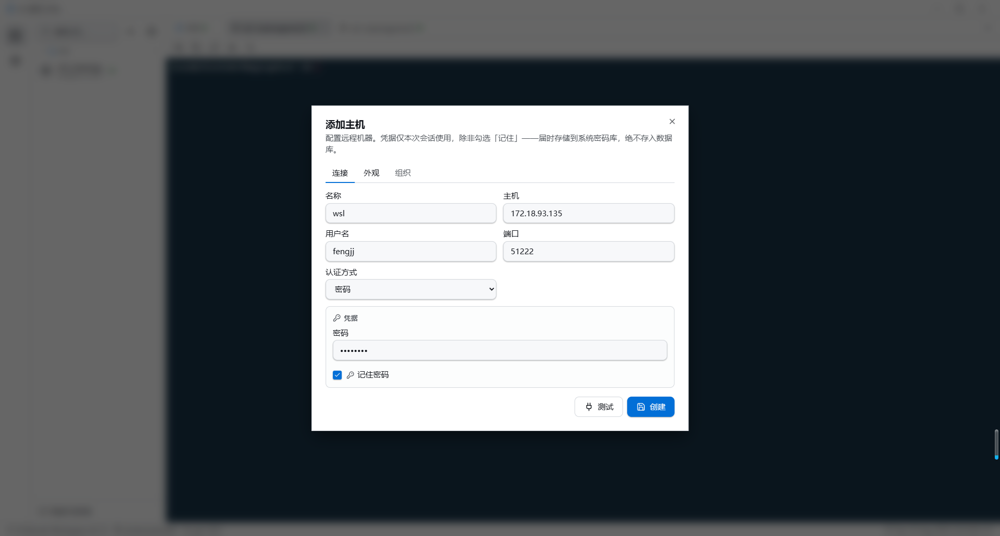
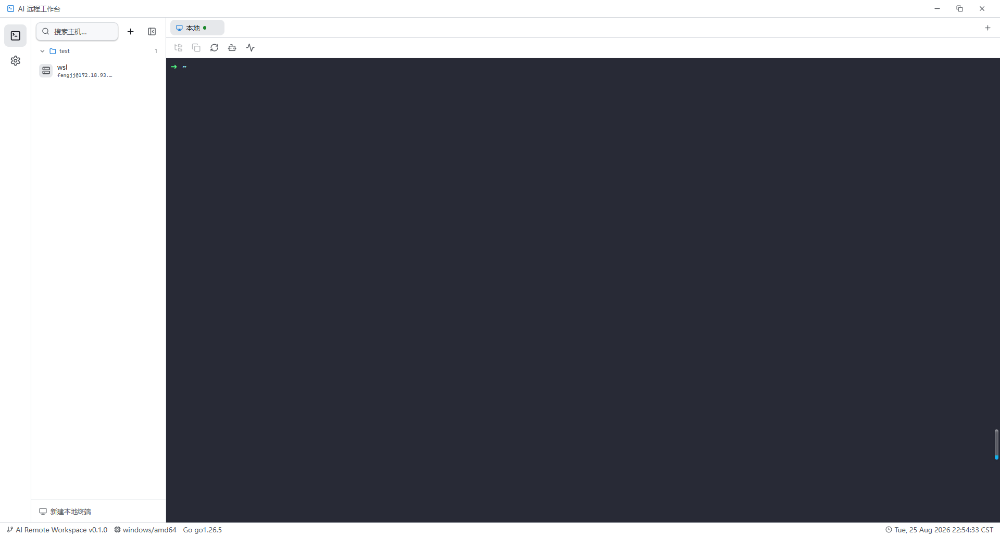
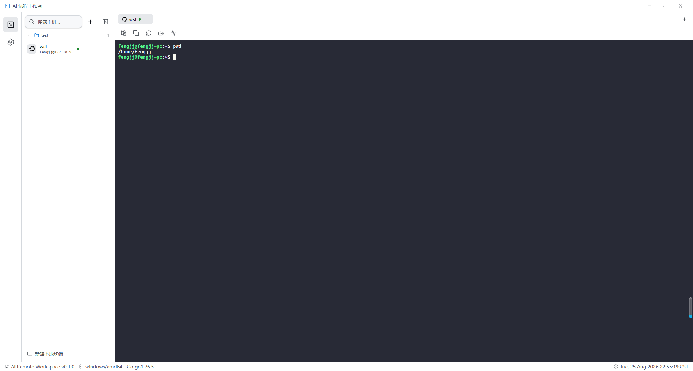
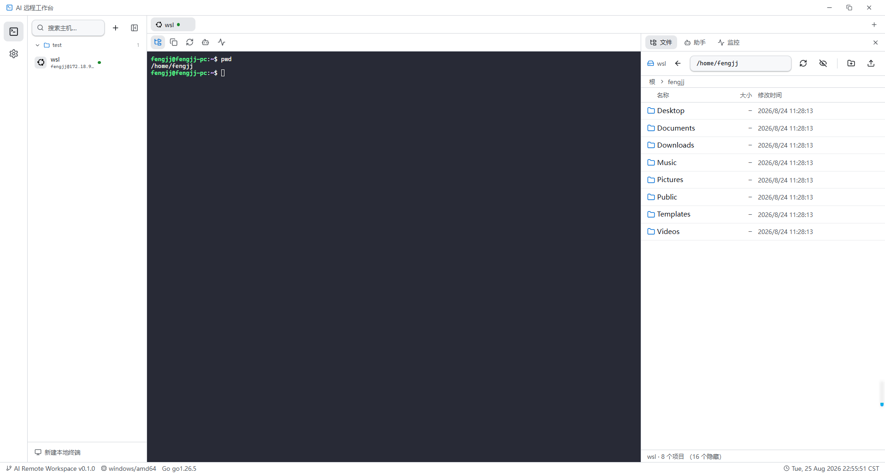
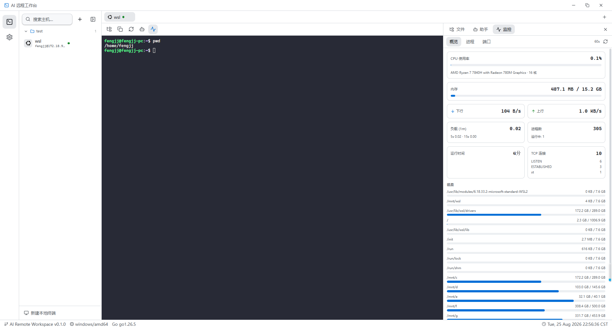
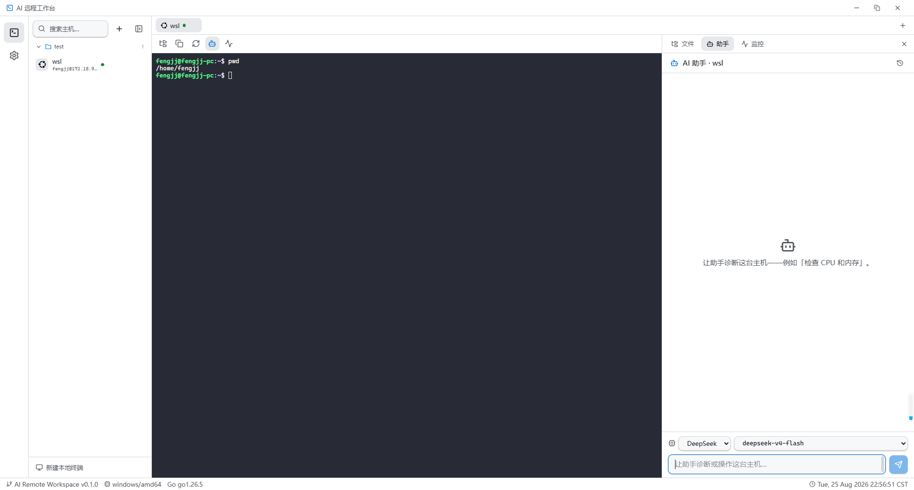
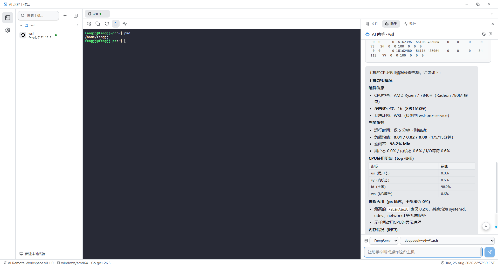

# AI Remote Workspace

> 一个轻量、本地优先、AI 增强的个人开发者 Remote Workspace。

Go 原生（Wails v3 + React）的跨平台桌面应用，把 **SSH / Terminal / SFTP / Local Shell / AI Agent / MCP / Docker / Kubernetes** 统一到一个面向个人开发者的 AI 工作环境。

不替代传统 SSH Client，而是让 AI 在「Remote Context + Tools + Permission」之上真正完成运维与诊断工作。

> 受[Netcatty](https://github.com/binaricat/Netcatty)启发，但是electron的依赖太重量级了，作为一个轻度工具，使用wails3+golang的webview2方案是个更好的选择。
> 
> 保持轻量级的工具实现，只增加必要的功能。

## 核心特性

- 🔌 **SSH Workspace** — 多 Host 管理、稳定终端（xterm.js + PTY）
- 🖥️ **本地终端** — 跨平台本地 PTY（PowerShell / bash / zsh），不走 SSH
- 📁 **SFTP 文件管理** — 浏览、上传、下载
- 📊 **主机监控** — 概览 / 进程 / 端口三个视图，基于 `/proc` 与系统原生工具采集，远程主机零依赖
- 🤖 **AI Agent** — LLM + Tool Calling，本地与远程统一执行，危险操作审批
- 🎨 **外观与快捷键** — Xshell 风格的终端外观设置（13 套配色 / 字体 / 字号实时预览）与可自定义快捷键（含鼠标中键行为）
- 🔐 **分层安全** — 系统密码库托管敏感数据，危险操作需用户授权
- (TBD) 🔗 **MCP Server** — 让 Claude / Codex / Cursor 等外部 Agent 复用本地能力
- 📦 **单 Binary** — 下载即用，无需复杂部署

## 技术栈

桌面应用基于 **Wails v3**（Go 原生，单 Binary，跨平台）：

| 层                 | 技术                                                               |
| ----------------- | ---------------------------------------------------------------- |
| Desktop Framework | Wails v3                                                         |
| Backend           | Go 1.24+                                                         |
| LLM Agent         | [Eino](https://github.com/cloudwego/eino) from bytedance                 |
| Frontend          | React 19 · TypeScript · Vite                                     |
| Styling           | Tailwind CSS v4 · shadcn/ui · Radix UI                           |
| State / Data      | Zustand · TanStack Query                                         |
| Icons             | Lucide                                                           |
| Terminal          | xterm.js                                                         |
| Storage           | SQLite（纯 Go 驱动 modernc.org/sqlite，无 CGO）                         |
| SSH               | golang.org/x/crypto/ssh（认证 / keepalive / PTY / 已知主机校验）           |
| SFTP              | github.com/pkg/sftp（远程文件操作，连接缓存）                                 |
| AI Agent          | CloudWeGo eino（ReAct Agent + Tool Calling + 流式）+ eino-ext openai |

> 技术栈以 [`AGENT.md`](./AGENT.md)（Coding Agent Guide）为准。

## 快速开始

### 前置依赖

- **Go** 1.25+
- **Node.js** 20.19+（推荐 22.12+）
- **Wails v3 CLI**：`go install github.com/wailsapp/wails/v3/cmd/wails3@latest`

### 开发

```bash
# 热重载开发模式（启动桌面窗口 + 前端 HMR）
wails3 task dev
```

### 构建

```bash
# 跨平台构建准备
wails3 task setup:docker


# 生产构建，产出 bin/ai-remote-workspace.exe（Windows）
# 构建 Windows (无需 Docker，直接编译)
wails3 build GOOS=windows GOARCH=amd64

# 构建 macOS (自动唤起 Docker)
wails3 build GOOS=darwin GOARCH=arm64    # Apple Silicon
wails3 build GOOS=darwin GOARCH=amd64    # Intel
wails3 task darwin:build:universal       # 通用双架构 Universal Binary

# 构建 Linux (自动唤起 Docker)
wails3 build GOOS=linux GOARCH=amd64
# 构建mac
```

构建产出为**单 Binary**，前端已通过 `//go:embed` 嵌入。

### 打包

使用wail3自带能力，需要准备一些工具

```bash
# 为当前平台打包安装包
wails3 package

# 显式指定平台打包
wails3 package GOOS=windows
wails3 package GOOS=darwin
wails3 package GOOS=linux
```

Wails v3 会根据平台自动输出对应的安装包格式：

- **Windows**：生成 NSIS 单文件安装包（安装向导 `.exe`）

- **macOS**：生成带图标的 `.dmg` / `.app` Bundle

- **Linux**：生成 `.AppImage`、`.deb` 以及 `.rpm` 包

#### 各平台打包及前提依赖条件

#### 1. Windows 安装包 (`.exe` / NSIS)

Wails 默认使用 **NSIS (Nullsoft Scriptable Install System)** 来封装 Windows 安装包。

- **前置依赖**（需安装 NSIS 并加入系统环境变量）：
  
  - **Windows**：`winget install NSIS.NSIS` 或 `scoop install nsis`
  
  - **macOS**：`brew install nsis`
  
  - **Linux**：`sudo apt install nsis` (Ubuntu/Debian)

- **打包指令**：
  
  Bash
  
  ```
  wails3 task windows:package
  ```

- **配置文件**：打包信息（如公司名、产品版本、安装路径）取自 `build/windows/installer` 目录下的 NSIS 配置文件和 `build/config.yml`。

#### 2. macOS 安装包 (`.app` / `.dmg` / `.pkg`)

macOS 打包会自动进行图标嵌入、plist 配置，并可一键打包成双架构（Intel + Apple Silicon）通用镜像。

- **打包指令**：
  
  Bash
  
  ```
  # 为当前架构打包 .app / .dmg
  wails3 task darwin:package
  
  # 打包 macOS Universal 通用二进制安装包（同时支持 M1/M2/M3 和 Intel Mac）
  wails3 task darwin:package:universal
  ```

- **高级签名（用于分发）**：
  
  若需发布给大众用户，建议在环境变量中配置 Apple 证书，Taskfile 会在打包时自动唤起 `codesign` 和 `notarytool` 进行代码签名与苹果公证。

#### 3. Linux 安装包 (`.AppImage` / `.deb` / `.rpm`)

Linux 支持一次性生成主流的二进制安装包。

- **前置依赖**：
  
  - 打包 `AppImage` 需要系统安装有 `appimagetool`。
  
  - 打包 `.deb` 需要系统内置 `dpkg-deb`。
  
  - 打包 `.rpm` 需要安装 `rpmbuild`。

- **分步或针对性打包指令**：
  
  Bash
  
  ```
  # 生成 DEB 安装包 (适用于 Ubuntu / Debian)
  wails3 task linux:create:deb
  
  # 生成 AppImage 免安装镜像 (适用于绝大多数 Linux 发行版)
  wails3 task linux:create:appimage
  
  # 执行完整的 Linux 打包流程
  wails3 task linux:package
  ```

## 项目结构

```
.
├── main.go                 # 应用入口：组装各层 + Wails 窗口 + time 事件
├── internal/
│   ├── domain/             # 业务模型（Host/Session/Tool/Agent/Config/SSH）
│   ├── application/        # 业务流程 + port 接口（HostService/ConnectionManager）
│   ├── infrastructure/
│   │   ├── agent/          # Agent 会话管理（多轮对话 / 工具调用执行 / 会话持久化）
│   │   ├── localpty/       # 本地终端 PTY（Windows ConPTY / Unix pty）
│   │   ├── secret/         # OS 密码库（Windows Credential Manager / macOS Keychain / Linux Secret Service）
│   │   ├── sftp/           # SFTP Manager（连接缓存）+ 文件操作（ls/upload/download/delete/rename/mkdir）
│   │   ├── sqlite/         # SQLite 存储实现 + schema 迁移（hosts/host_keys/settings）
│   │   └── ssh/            # SSH Client / PTY Session / ConnectionManager / 已知主机校验
│   └── interfaces/         # Wails Services（Host/Terminal/SFTP/Agent/Monitor/ModelProvider/Config）
├── frontend/
│   ├── src/
│   │   ├── app/            # providers, router
│   │   ├── features/       # Feature-Based：hosts/ terminal/ agent/ sftp/ monitor/ settings/
│   │   ├── keybindings/    # 快捷键系统（命令表 / 键位匹配 / 全局分发）
│   │   ├── i18n/           # i18next 初始化（zh / en 文案见 locales/）
│   │   ├── components/     # ui/ (shadcn), layout/ (AppShell/Sidebar/StatusBar)
│   │   ├── stores/         # 全局状态（Zustand）
│   │   ├── lib/            # utils, queryClient, wails helpers
│   │   ├── styles/         # Design Token (globals.css)
│   │   └── themes/         # Dark theme token overrides
│   └── bindings/           # Wails 自动生成的 TS 绑定（勿手改）
├── build/                  # 各平台打包资源（Windows/macOS/Linux/iOS/Android）
└── docs/                   # PRD / 架构 / 安全 / 路线图 / 截图（screenshots/）
```


## 截图

|      |      |
| :--: | :--: |
|  |  |
| **主机管理** — 添加主机（连接 / 外观 / 分组） | **多标签终端工作区** — 主机侧栏 + SSH / 本地终端混排 |
|  |  |
| **终端外观设置** — 配色 / 字体 / 字号实时预览 | **SFTP 文件管理** — 浏览 / 上传 / 下载 |
|  |  |
| **主机监控** — 概览 / 进程 / 端口 | **AI 助手** — 模型选择 + 会话对话 |

<p align="center">
  
</p>

<p align="center"><b>AI 助手</b> — 主机诊断报告（CPU / 负载 / 进程 / 内存）</p>

