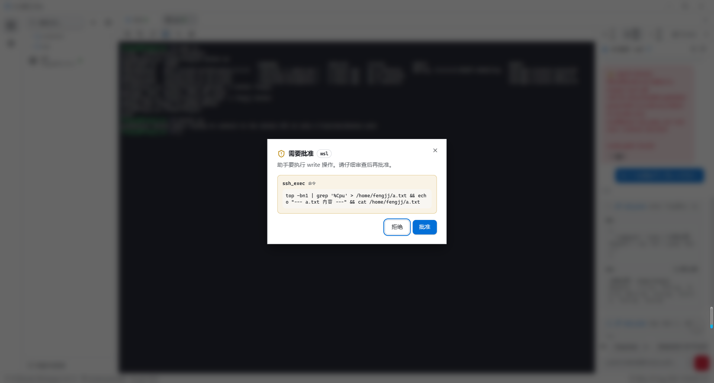
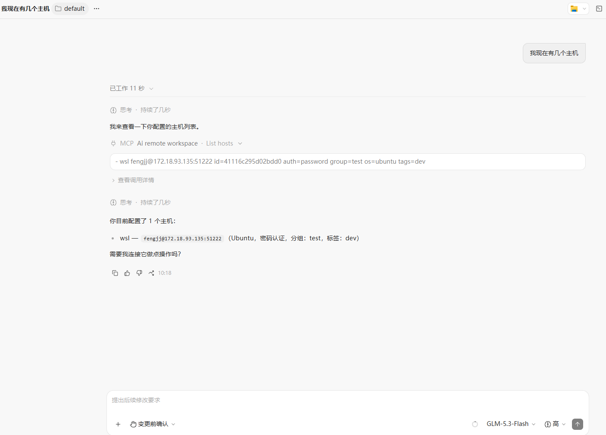

# AI Remote Workspace

<div align="right">

[简体中文](./README.md) | [English](./README_EN.md)

</div>

> A lightweight, local-first, AI-enhanced remote workspace for developers.

A cross-platform desktop app built natively in Go (Wails v3 + React) that unifies **SSH / Terminal / SFTP / Local Shell / AI Agent** into a single AI-powered work environment for individual developers.

It does not replace traditional SSH clients — it lets AI do real ops and diagnosis work on top of a "remote context + tools + permissions" model.

> Inspired by [Netcatty](https://github.com/binaricat/Netcatty), but Electron is too heavyweight. For a lightweight tool, the Wails v3 + Go WebView2 approach is the better fit.
>
> Stay minimal — only add what is necessary.

## Core Features

- 🔌 **SSH Workspace** — multi-host management with a rock-solid terminal (xterm.js + PTY): split panes with broadcast input, auto-reconnect on drop, session restore after restart, session logging, login scripts, terminal encoding switching (UTF-8 / GBK / Big5), jump hosts / proxies, system notifications on unfocused completion
- 🖥️ **Local Terminal** — cross-platform local PTY (PowerShell / PowerShell 7 / CMD / Git Bash / WSL per-distro / bash / zsh, detected by availability) — no SSH involved
- 📁 **SFTP File Manager** — browse, upload, download
- 📊 **Host Monitoring** — overview / processes / ports views, collected via `/proc` and native tools with zero remote dependencies
- 🐳 **Docker Panel** — containers / images / networks / volumes / stats views with container lifecycle control (start / stop / restart / pause, allowlist + confirmation dialogs); kubectl / docker CLI collection over SSH or local channels, degrading gracefully when the CLI or daemon is missing
- ☸️ **Kubernetes Panel** — everyday cluster management: workload (Deployment / StatefulSet / DaemonSet) scale and rollout restart, Pod list with multi-container logs, Services, events, node cards (resource usage + YAML view/apply); namespace scoping. CRDs and other free-form resources are intentionally out of scope
- 🤖 **AI Agent** — LLM + tool calling (OpenAI-compatible multi-model), unified local and remote execution, tiered approval for dangerous operations
- 🧑‍💻 **Ops Experts** — an expert system following the industry Agent directory layout: each expert is a directory (manifest.json identity card + SOUL.md persona core + HEARTBEAT.md operational guidance + skills/ private packs). Ships with 6 builtin experts — K8s Ops, K8s Developer, Docker, Linux, Database, SRE Diagnosis — plus the **default "General Assistant"**. Expert-private skills never appear in the public list and shadow same-name public skills inside that expert's sessions. Experts export/import as self-contained zip packages (imported as new custom experts, zip-slip guarded). Personas can never override the approval safety boundary
- 🩺 **Scenario Library & `$` Skill Invocation** — 14 builtin diagnosis scenario packs (CPU high / disk full / OOM / service down / port unreachable / container restart loop …, including MIT-0 adaptations from the SkillHub community). Type `$` for a dropdown, invoke with `$name`, highlighted in the input box. Skills support the directory form (bundled scripts and reference docs); conversations can be distilled into new scenarios by AI
- 📋 **Fault Report Tracker** — distill an agent troubleshooting session into a structured fault report (phenomenon / root cause / evidence / actions / prevention + severity) with one click, attached to the host as a traceable asset. A dedicated tracker page filters by host / keyword / severity / status, and reports follow an open → monitoring → resolved lifecycle
- 🎨 **Look & Keymaps** — Xshell-style terminal appearance (13 color schemes / font / size with live preview) and customizable shortcuts (including middle-click behavior)
- 🌐 **Bilingual UI** — switch between 中文 and English in one click (Settings → Language)
- 🔐 **Layered Security** — OS keychain for secrets + a key manager (Ed25519 / RSA / ECDSA generation, import, export); dangerous operations require user approval
- 🔗 **MCP Server** — exposes host / terminal / file capabilities as MCP tools to external agents (Claude Desktop, Codex, Cursor …); writes still require in-app approval
- 📦 **Single Binary** — download and run, zero deployment

## Download

Grab the installer or standalone binary for your platform from [GitHub Releases](../../releases):

- **Windows**: NSIS installer (`.exe`) or portable single file
- **macOS**: `.dmg` / `.app` (Intel and Apple Silicon)
- **Linux**: `.AppImage` / `.deb` / `.rpm`

## Tech Stack

The desktop app is built on **Wails v3** (native Go, single binary, cross-platform):

| Layer             | Technology                                                       |
| ----------------- | ---------------------------------------------------------------- |
| Desktop Framework | Wails v3                                                         |
| Backend           | Go 1.24+                                                         |
| LLM Agent         | [Eino](https://github.com/cloudwego/eino) from bytedance         |
| Frontend          | React 19 · TypeScript · Vite                                     |
| Styling           | Tailwind CSS v4 · shadcn/ui · Radix UI                           |
| State / Data      | Zustand · TanStack Query                                         |
| Icons             | Lucide                                                           |
| Terminal          | xterm.js                                                         |
| Storage           | SQLite (pure-Go driver modernc.org/sqlite, no CGO)               |
| SSH               | golang.org/x/crypto/ssh (auth / keepalive / PTY / host key check) |
| SFTP              | github.com/pkg/sftp (remote file ops, connection cache)          |
| AI Agent          | CloudWeGo eino (ReAct Agent + tool calling + streaming) + eino-ext openai |

> See [`AGENT.md`](./AGENT.md) (Coding Agent Guide) for the authoritative stack reference.

## Getting Started

### Prerequisites

- **Go** 1.25+
- **Node.js** 20.19+ (22.12+ recommended)
- **Wails v3 CLI**: `go install github.com/wailsapp/wails/v3/cmd/wails3@latest`

### Development

```bash
# Hot-reload dev mode (desktop window + frontend HMR)
wails3 task dev
```

### Build

```bash
# Cross-platform build prep
wails3 task setup:docker

# Production build → bin/ai-remote-workspace.exe (Windows)
# Build for Windows (no Docker needed, direct compile)
wails3 build GOOS=windows GOARCH=amd64

# Build for macOS (spins up Docker automatically)
wails3 build GOOS=darwin GOARCH=arm64    # Apple Silicon
wails3 build GOOS=darwin GOARCH=amd64    # Intel
wails3 task darwin:build:universal       # Universal binary

# Build for Linux (spins up Docker automatically)
wails3 build GOOS=linux GOARCH=amd64
```

The output is a **single binary** — the frontend is embedded via `//go:embed`.

### Packaging

Uses Wails' built-in packaging; some tools are required per platform.

```bash
# Package for the current platform
wails3 package

# Package for an explicit platform
wails3 package GOOS=windows
wails3 package GOOS=darwin
wails3 package GOOS=linux
```

Wails v3 automatically emits the platform-native installer format:

- **Windows**: single NSIS installer (`.exe` wizard)
- **macOS**: `.dmg` / `.app` bundle with icons
- **Linux**: `.AppImage`, `.deb`, and `.rpm`

#### Platform packaging prerequisites

#### 1. Windows installer (`.exe` / NSIS)

Wails uses **NSIS (Nullsoft Scriptable Install System)** for Windows installers.

- **Prerequisites** (install NSIS and add it to PATH):
  - **Windows**: `winget install NSIS.NSIS` or `scoop install nsis`
  - **macOS**: `brew install nsis`
  - **Linux**: `sudo apt install nsis` (Ubuntu/Debian)

- **Command**:
  ```
  wails3 task windows:package
  ```

- **Configuration**: installer metadata (company, product version, install path) comes from the NSIS config in `build/windows/installer` and `build/config.yml`.

#### 2. macOS packages (`.app` / `.dmg` / `.pkg`)

macOS packaging embeds icons, applies plist configuration, and can build a universal (Intel + Apple Silicon) image in one step.

- **Commands**:
  ```
  # Package .app / .dmg for the current architecture
  wails3 task darwin:package

  # Universal binary package (M1/M2/M3 and Intel)
  wails3 task darwin:package:universal
  ```

- **Advanced signing (for distribution)**:
  configure Apple certificates via environment variables; the Taskfile will invoke `codesign` and `notarytool` automatically for signing and notarization.

#### 3. Linux packages (`.AppImage` / `.deb` / `.rpm`)

Linux builds all mainstream package formats in one pass.

- **Prerequisites**:
  - `appimagetool` for AppImage
  - `dpkg-deb` for .deb
  - `rpmbuild` for .rpm

- **Commands**:
  ```
  # Build the DEB installer (Ubuntu / Debian)
  wails3 task linux:create:deb

  # Build the AppImage portable image
  wails3 task linux:create:appimage

  # Full Linux packaging pipeline
  wails3 task linux:package
  ```

## MCP Server

The app ships a local MCP (Model Context Protocol) server so external AI agents — Claude Desktop, Cursor, Codex … — can reuse the hosts and file capabilities already configured in the workspace. Credentials stay in the OS keychain and are never exposed to external clients.

### Enable

**Settings → Advanced → MCP Server**:

1. Check "Enable MCP Server" — the first enable generates and persists a Bearer token automatically;
2. Port defaults to `8765` (bound to `127.0.0.1` only, configurable);
3. Copy the client snippet from the card into your agent's MCP config; click "Regenerate" to revoke the old token.

### Tools

| Tool | Description | Permission |
| ----------------- | ---------------------------------------- | ----------------------- |
| `list_hosts` | List configured SSH hosts (id / address / auth / group) | auto |
| `connect_host` | Connect a host and verify reachability; reused by later calls | auto |
| `exec_command` | Run a command on a remote host (auto-connect) | tiered per command (dangerous ones need approval) |
| `read_file` / `download` | SFTP read a remote file / download to local | auto |
| `write_file` / `upload` | SFTP write a remote file / upload from local | in-app approval required |
| `system_info` | App version / platform / host count / MCP status | auto |

### Client configuration

Claude Desktop / Cursor (Streamable HTTP):

```json
{
  "mcpServers": {
    "ai-remote-workspace": {
      "url": "http://127.0.0.1:8765/mcp",
      "headers": { "Authorization": "Bearer <your-token>" }
    }
  }
}
```

For stdio-only clients such as Codex CLI, bridge with `mcp-remote`:

```bash
npx mcp-remote http://127.0.0.1:8765/mcp --header "Authorization: Bearer <your-token>"
```

> **Security boundary**: loopback-only binding + Bearer token; every WRITE/DANGEROUS operation pops an in-app approval dialog (with the target host labeled) — deny or 5-minute timeout aborts it, exactly like the built-in agent's approval flow.

## Project Structure

```
.
├── main.go                 # App entry: layer assembly + Wails window + time events
├── internal/
│   ├── domain/             # Business models (Host/Session/Tool/Agent/Config/Expert/FaultReport…)
│   ├── application/        # Use cases + port interfaces (HostService/ConnectionManager/SkillService/ExpertService/FaultReportService…)
│   │   └── skills/         # Builtin scenario packs (go:embed, 14 SKILL.md + bundled scripts)
│   │   └── experts/        # Builtin expert directories (go:embed, 7 × manifest/SOUL/HEARTBEAT)
│   ├── infrastructure/
│   │   ├── agent/          # Agent runtime (multi-turn chat / ReAct tool calls / persistence / scenario & report distillation)
│   │   ├── localpty/       # Local terminal PTY (Windows ConPTY / Unix pty)
│   │   ├── mcpserver/      # Local MCP server (Streamable HTTP @ 127.0.0.1 + Bearer token)
│   │   ├── secret/         # OS keychain (Windows Credential Manager / macOS Keychain / Linux Secret Service)
│   │   ├── sftp/           # SFTP manager (connection cache) + file ops
│   │   ├── sqlite/         # SQLite storage + AutoMigrate (hosts/settings/conversations/experts/fault_reports…)
│   │   └── ssh/            # SSH client / PTY session / connection manager / known-hosts verification
│   └── interfaces/         # Wails services (Host/Terminal/SFTP/Agent/Monitor/Docker/K8s/Expert/FaultReport/ModelProvider/Config/MCP…)
├── frontend/
│   ├── src/
│   │   ├── features/       # Feature-based: hosts/ terminal/ agent/ sftp/ monitor/ docker/ k8s/ experts/ faults/ settings/
│   │   ├── keybindings/    # Shortcut system (command table / matching / global dispatch)
│   │   ├── i18n/           # i18next setup (zh / en strings in locales/)
│   │   ├── components/     # ui/ (shadcn), layout/ (AppShell/Sidebar/StatusBar)
│   │   ├── stores/         # Global state (Zustand)
│   │   ├── lib/            # utils, queryClient, wails helpers
│   │   └── styles/         # Design tokens (globals.css) + themes/
│   └── bindings/           # Wails-generated TS bindings (do not edit)
├── build/                  # Per-platform packaging assets (Windows/macOS/Linux/iOS/Android)
└── docs/                   # PRD / architecture / security / roadmap / todo
```

## Screenshots

|                                             |                                           |
|:-------------------------------------------:|:-----------------------------------------:|
|              |        |
| **Hosts** — add a host (connection / appearance / group) | **Multi-tab workspace** — host sidebar + mixed SSH / local terminals |
|            |  |
| **Appearance** — color scheme / font / size with live preview | **SFTP** — browse / upload / download |
|      |    |
| **Monitoring** — overview / processes / ports  | **AI assistant** — model picker + chat                   |
|  |    |
| **Diagnosis report** — host report (CPU / load / processes / memory)  | **High-risk approval**                       |
|  |                                               |
| **MCP Server** — external agent listing hosts via `list_hosts` |                                             |
